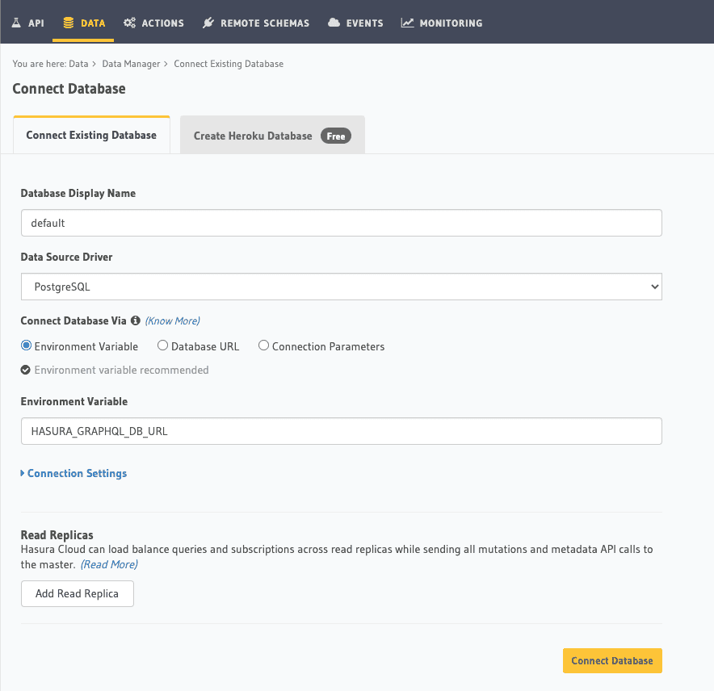
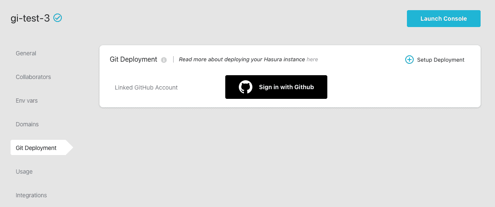
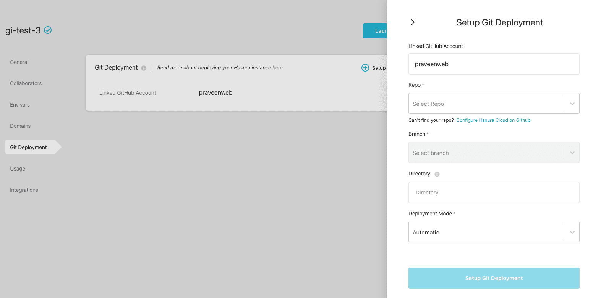
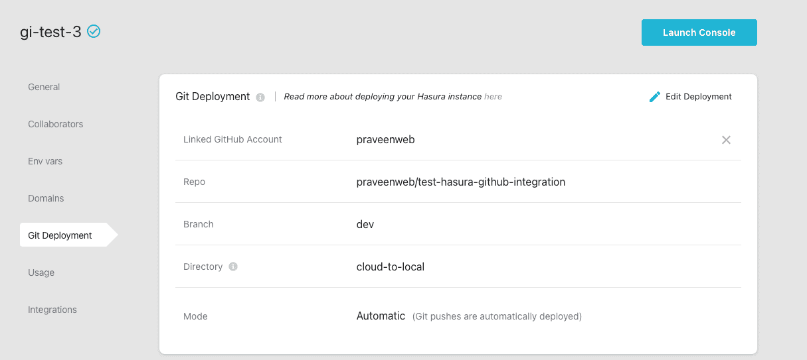
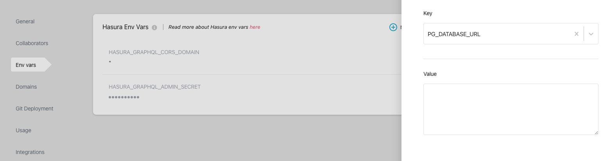

# Hasura Github Integration Starter Kit

Hasura's github integration automatically deploys your github projects using Hasura Cloud, providing automatic updates of your metadata and database migrations from your repo.

## Moving from local dev to Hasura Cloud

Let's say you started developing your app using the OSS version of `hasura/graphql-engine` image locally using docker. Now you want to apply the changes to the Hasura Cloud project. The first step is to create a Hasura Cloud project.

[](https://cloud.hasura.io/?pg=github-integration-demo&plcmt=body&tech=default)

Once a project is created, we will launch console and Connect a Database. Depending on how your local development database has been setup, give the same database name here for this connection. For example `default` is the database name that is used with docker-compose setup initially. Update the name accordingly.



Once a database is connected, we can configure Git Deployment.

### Configure git deployment

Head to [https://cloud.hasura.io](https://cloud.hasura.io), select the cloud project and go to `Git Deployment` tab on the navigation menu.



Now Sign in with Github to configure the repo for this project.



After selecting the repo/branch, choose the deployment mode.

There are two modes possible:

- Automatic: Deployment is triggered automatically when git push happens to the configured repo/branch.
- Manual: Deployment can only be manually triggered from the dashboard.



Now, go back to your git repo directory. Assuming you have made some schema or metadata changes via the Console, you can now just git push to trigger a deployment.

```bash
git add .
git commit -m "added tables"
git push origin <configured-branch>
```

### Try it out

We have a sample Hasura project in this repo that you can use to quickly try this out. To move from local to cloud, you can make use of the directory `local-to-cloud` to do git push.

## Moving from Hasura Cloud to local dev

Let's say you started developing your app by using a Hasura Cloud project. Now you want to move the current database schema and metadata on the Cloud to a local development setup.

The first step is to initialise a hasura project locally.

```bash
hasura init <project-name>
```

Once a project directory is created, we need to initialise the migration files, pulling the database schema from the cloud project.

```bash
hasura migrate create init --sql-from-server --endpoint <hasura-project-url> --admin-secret <admin-secret>
```

Now head to the migrations directory to check the version of the migration generated.

```bash
cd migrations/default
```

Note down the directory name, which would look something like this `1627564572630_init`. Just copy the version number without the `_init` parts of the name.

```bash
hasura migrate apply --endpoint <hasura-project-url> --admin-secret <admin-secret> --version 1627564572630 --skip-execution
```

It is important to add the `skip-execution` flag since that marks the migration as applied. This is to ensure that the schema that is already created on Hasura Cloud project is not getting applied again, which would end in an error state.

Finally, we need to export metadata:

```bash
hasura metadata export --endpoint <hasura-project-url> --admin-secret <admin-secret> 
```

We have successfully synced our state from Cloud to a local dev environment. As you make changes to the schema and metadata and push it to a dev branch, you should be able to sync those changes to the Cloud project again.

Start local development of the project using the Hasura CLI

```bash
hasura console
```

This will use the default localhost endpoint in `config.yaml`. You can now use the console to modify schema and metadata.

The next step is to configure git deployment on the Cloud project by following the steps above.

Thats it! The migrations and metadata changes will be applied automatically. In case you have selected a manual deployment, you can head to Cloud dashboard and choose to manually trigger a deployment.

### Try it out

We have a sample Hasura project in this repo that you can use to quickly try this out. To move from cloud to local, you can make use of the directory `cloud-to-local` to do git push. This project has Cloud specific metadata like `api_limits.yaml` that gets ignored in your local development but gets applied on Cloud during git deployment.

## Moving between two Hasura Cloud instances

This use case is typically for moving between staging and production environments, both of which are in Hasura Cloud.

Now there are two possibilities here. Either you already have a Hasura project structure locally created using the CLI or you just started with a Cloud project to experiment as a dev setup and now want to move the current schema to another cloud project for staging or production.

In the first case of having an existing project structure locally, all we need to do is,

- Add the environment variable `PG_DATABASE_URL` for the right database connection string. The `env` name should match the one on the local project and hence we have used the default one that comes in the docker-compose setup. Feel free to update this value depending on what your local configuration looks like.

Head to `cloud.hasura.io`, choose the project you want to migrate to and go to the project details page. Click on `Env vars` on the left sidebar navigation and add a new Env var for the database URL.



Once the database ENV is added, the next step is to identify other ENV variables that are used in local Hasura project setup. For example, if you are using Actions/Events/Remote Schemas and the handler URLs are coming from the ENV, then those envs should also be added appropriately.

Once that is done, we can head to configuring `Git Deployment` for the project. The steps are outlined above.

In the second case of starting with a Cloud project, we have to initialise the hasura project locally and follow the Git Deployment setup.
